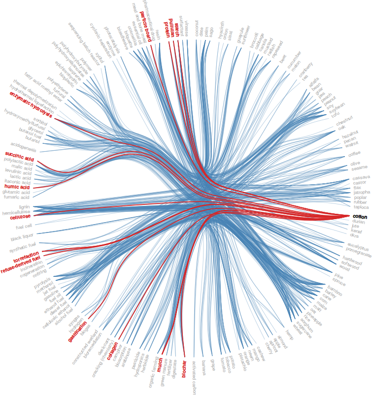

# Co-occurrence Analysis

Table of Contents
=================
    * [Co-occurence Visualization](#co-occurence-visualization)
    * [Top 50 Organisms and Technologies, Applications &amp; Products](#top-50-organisms-and-technologies-applications--products)
    * [Wastes](#wastes)
      * [Top 20](#top-20)
      * [Full Matrix](#full-matrix)
    * [Taxonomical Phylums](#taxonomical-phylums)
      * [Chemicals](#chemicals)
      * [Energy](#energy)
        * [Full Matrix](#full-matrix-1)
        * [Top 15](#top-15)
      * [Fertilizers](#fertilizers)
      * [Products](#products)
    * [Taxonomical Orders &amp; Energy](#taxonomical-orders--energy)
      * [Top 15](#top-15-1)
      * [Full Matrix](#full-matrix-2)
    * [Taxonomical Classes &amp; Energy](#taxonomical-classes--energy)
    * [Insects](#insects)

## Co-occurence Visualization

## Top 50 Organisms and Technologies, Applications & Products

## Wastes
### Top 20

### Full Matrix

## Taxonomical Phylums
### Chemicals

 	
### Energy
#### Full Matrix

#### Top 15

###  Fertilizers

### Products

## Taxonomical Orders & Energy
### Top 15

### Full Matrix

## Taxonomical Classes & Energy

## Insects

