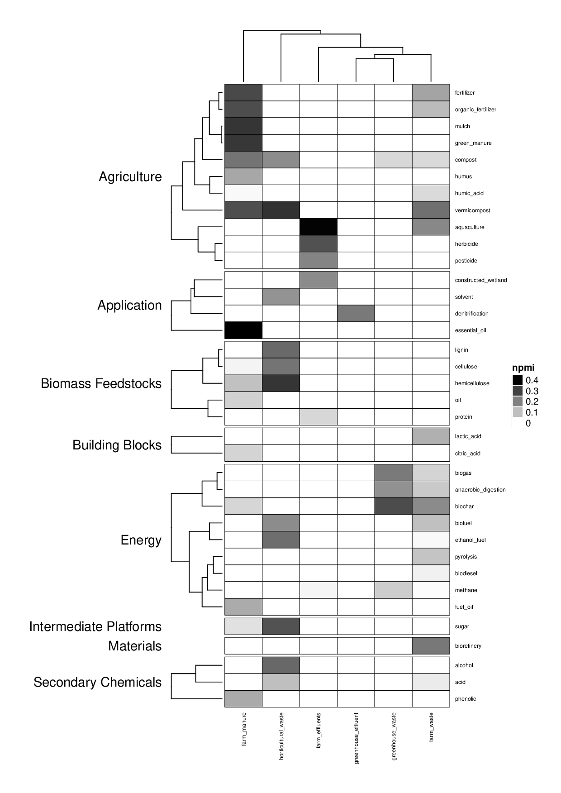

# Co-occurrence Analysis

## Co-occurence Visualization

Table of Contents
=================
 * [Interactive co-occurence Visualization](#co-occurence-visualization)
 * Groups of Wastes
   * [Alcohol Production - brewery, wine, distillery, malt, yeast](#alcohol-production-brewery-distillery-malt-wine-yeast)

## Alcohol Production - brewery, distillery, malt, yeast, wine

## Aquatic Wastes - aquaculture, fish, crustacean, mussel, oyster, shrimp, seafood, algae, seaweed

## Birds - poultry, turkey, duck, egg

## Dairy - cheese, milk, dairy

## Domestic Waste - household waste, kitchen waste, garden

## Fruit Trees - peach, olive, mango, orange, pomegranate, apple, apricot, banana

## General Agricultural Wastes - greenhouse, horticulture, farm

## Grains - wheat, sorghum, oat, maize, rice, barley

## Grasses - flax, sisal, kenaf, jute, bamboo, sugar cane

## Industrial Waste from Animal Materials - tannery, leather, slaughterhouse

## General Industrial Waste - dye, textile, carpet

## Mammals - cattle, swine, goat, rabbit, sheep, horse

## Non-food crops - coffee, tea, tobacco, cotton, lucerne, alfalfa, guayule

## Non-food trees - castor, jatropha, neem

## Nut trees - pistachio, hazelnut, almond, walnut

## Oil crops - sunflower, rapeseed, sesame, peanut

## Other Industrial Waste - tyre, rubber, sugar

## Palm - palm, coconut, sago, babassu

## Paper - newspaper, paper, paper mill, kraft

## Plant Crops - lettuce, mustard, okra, tomato, broccoli, cabbage, bean, mushroom, pineapple, cranberry, grape, guar

## Soy - soy, tofu

## Root Crops - onion, potato, cassava, beet, sugar beet

## Wood - wood, eucalyptus, forest, spruce, pine, poplar, sawmill, oak

