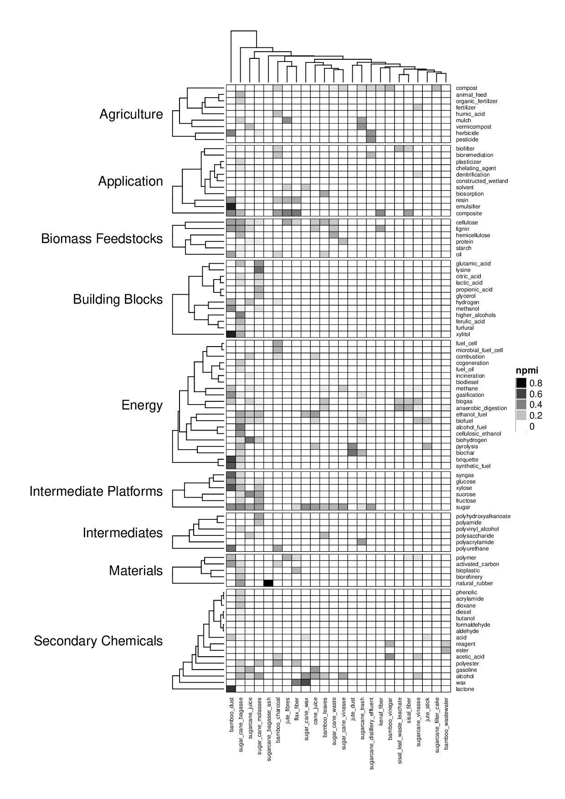
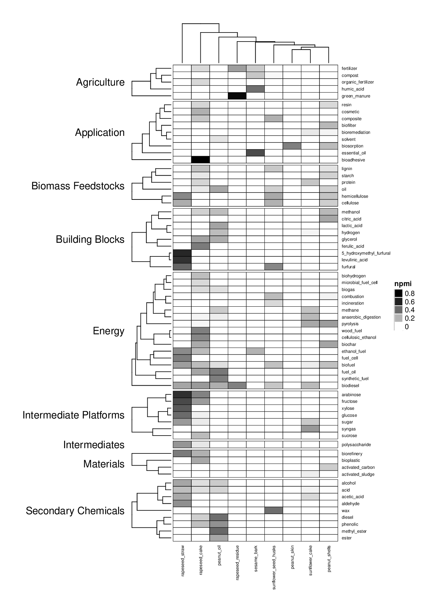

# Co-occurrence Analysis

## Co-occurence Visualization

Table of Contents
=================
 * [Interactive co-occurence Visualization](#co-occurence-visualization)
 * Groups of Wastes
   * [Alcohol Production - brewery, wine, distillery, malt, yeast](#alcohol-production---brewery-distillery-malt-wine-yeast)
   * [Aquatic Wastes - algae, aquaculture, crustacean, fish, mussel, oyster, seafood, seaweed, shrimp](#aquatic-wastes---algae-aquaculture-crustacean-fish-mussel-oyster-seafood-seaweed-shrimp)
   * [Birds - duck, egg, poultry, turkey](#birds---duck-egg-poultry-turkey)
   * [Dairy - cheese, dairy, milk](#dairy---cheese-dairy-milk)
   * [Domestic Waste - garden, household waste, kitchen waste](#domestic-waste---garden-household-waste-kitchen-waste)
   * [Fruit Trees - apple, apricot, banana, mango, olive, orange, peach, pomegranate](#fruit-trees---apple-apricot-banana-mango-olive-orange-peach-pomegranate)
   * [General Agricultural Wastes - farm, greenhouse, horticulture](#general-agricultural-wastes---farm-greenhouse-horticulture)
   * [Grains - barley, maize, oat, rice, sorghum, wheat](#grains---barley-maize-oat-rice-sorghum-wheat)
   * [Grasses - bamboo, flax, jute, kenaf, sisal, sugar cane](#grasses---bamboo-flax-jute-kenaf-sisal-sugar-cane)
   * [Industrial Waste from Animal Materials - leather, slaughterhouse, tannery](#industrial-waste-from-animal-materials---leather-slaughterhouse-tannery)
   * [General Industrial Waste - carpet, dye, textile](#general-industrial-waste---carpet-dye-textile)
   * [Mammals - cattle, goat, horse, rabbit, sheep, swine](#mammals---cattle-goat-horse-rabbit-sheep-swine)
   * [Non-food crops - alfalfa, coffee, cotton, guayule, lucerne, tea, tobacco](#non-food-crops---alfalfa-coffee-cotton-guayule-lucerne-tea-tobacco)
   * [Non-food trees - castor, jatropha, neem](#non-food-trees---castor-jatropha-neem)
   * [Nut trees - almond, hazelnut, pistachio, walnut](#nut-trees---almond-hazelnut-pistachio-walnut)
   * [Oil crops - peanut, rapeseed, sesame, sunflower](#oil-crops---peanut-rapeseed-sesame-sunflower)
   * [Other Industrial Waste - rubber, sugar, tyre](#other-industrial-waste---rubber-sugar-tyre)
   * [Palm - babassu, coconut, palm, sago](#palm---babassu-coconut-palm-sago)
   * [Paper - kraft, newspaper, paper, paper mill](#paper---kraft-newspaper-paper-paper-mill)
   * [Plant Crops - bean, broccoli, cabbage, cranberry, grape, guar, lettuce, mushroom, mustard, okra, pineapple, tomato](#plant-crops---bean-broccoli-cabbage-cranberry-grape-guar-lettuce-mushroom-mustard-okra-pineapple-tomato)
   * [Soy - soy, tofu](#soy---soy-tofu)
   * [Root Crops - beet, cassava, onion, potato, sugar beet](#root-crops---beet-cassava-onion-potato-sugar-beet)
   * [Wood - eucalyptus, forest, pine, poplar, sawmill, spruce, oak, wood](#wood---eucalyptus-forest-pine-poplar-sawmill-spruce-oak-wood)

## Alcohol Production - brewery, distillery, malt, wine, yeast

## Aquatic Wastes - algae, aquaculture, crustacean, fish, mussel, oyster, seafood, seaweed, shrimp

## Birds - duck, egg, poultry, turkey

## Dairy - cheese, dairy, milk

## Domestic Waste - garden, household waste, kitchen waste

## Fruit Trees - apple, apricot, banana, mango, olive, orange, peach, pomegranate

## General Agricultural Wastes - farm, greenhouse, horticulture

## Grains - barley, maize, oat, rice, sorghum, wheat

## Grasses - bamboo, flax, jute, kenaf, sisal, sugar cane

## Industrial Waste from Animal Materials - leather, slaughterhouse, tannery

## General Industrial Waste - carpet, dye, textile

## Mammals - cattle, goat, horse, rabbit, sheep, swine

## Non-food crops - alfalfa, coffee, cotton, guayule, lucerne, tea, tobacco

## Non-food trees - castor, jatropha, neem

## Nut trees - almond, hazelnut, pistachio, walnut

## Oil crops - peanut, rapeseed, sesame, sunflower

## Other Industrial Waste - rubber, sugar, tyre

## Palm - babassu, coconut, palm, sago

## Paper - kraft, newspaper, paper, paper mill

## Plant Crops - bean, broccoli, cabbage, cranberry, grape, guar, lettuce, mushroom, mustard, okra, pineapple, tomato

## Soy - soy, tofu

## Root Crops - beet, cassava, onion, potato, sugar beet

## Wood - eucalyptus, forest, pine, poplar, sawmill, spruce, oak, wood

