# Co-occurrence Matrices

Table of Contents
=================
  * [Co-occurrence Matrices](#co-occurrence-matrices)
  * [Table of Contents](#table-of-contents)
    * [Top 50 Organisms and Technologies, Applications &amp; Products](#top-50-organisms-and-technologies-applications--products)
    * [Wastes](#wastes)
      * [Top 20](#top-20)
      * [Full Matrix](#full-matrix)
    * [Taxonomical Phylums](#taxonomical-phylums)
      * [Chemicals](#chemicals)
      * [Energy](#energy)
        * [Full Matrix](#full-matrix-1)
        * [Top 15](#top-15)
      * [Fertilizers](#fertilizers)
      * [Products](#products)
    * [Taxonomical Orders &amp; Energy](#taxonomical-orders--energy)
      * [Top 15](#top-15-1)
      * [Full Matrix](#full-matrix-2)
    * [Taxonomical Classes &amp; Energy](#taxonomical-classes--energy)
    * [Insects](#insects)

## Top 50 Organisms and Technologies, Applications & Products
[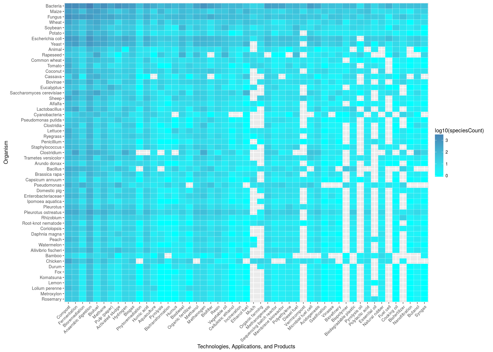](https://raw.githubusercontent.com/isdata-org/mapping-the-bioeconomy/master/CoOccurrenceMatrices/images/Top50Species.png)

## Wastes
### Top 20
[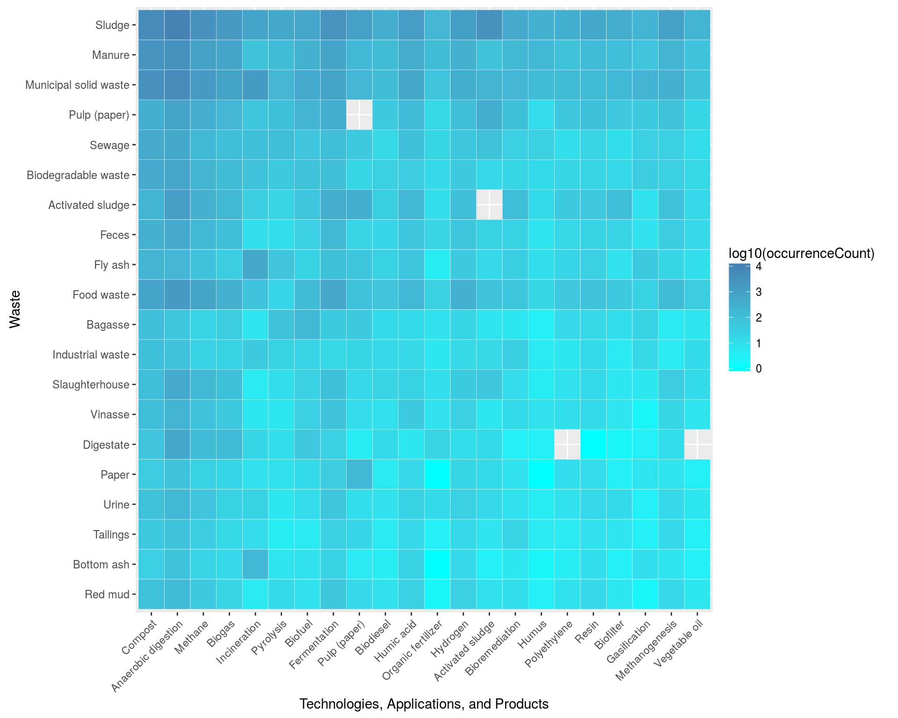](https://raw.githubusercontent.com/isdata-org/mapping-the-bioeconomy/master/CoOccurrenceMatrices/images/Top20Wastes.png)
### Full Matrix
[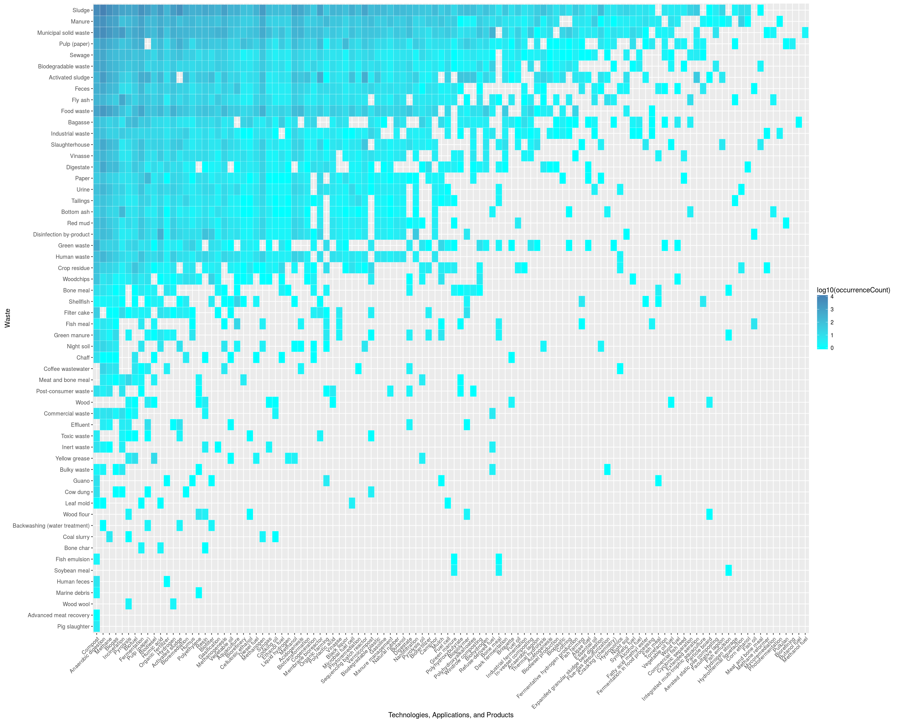](https://raw.githubusercontent.com/isdata-org/mapping-the-bioeconomy/master/CoOccurrenceMatrices/images/FullWasteMatrix.png)

## Taxonomical Phylums
### Chemicals
[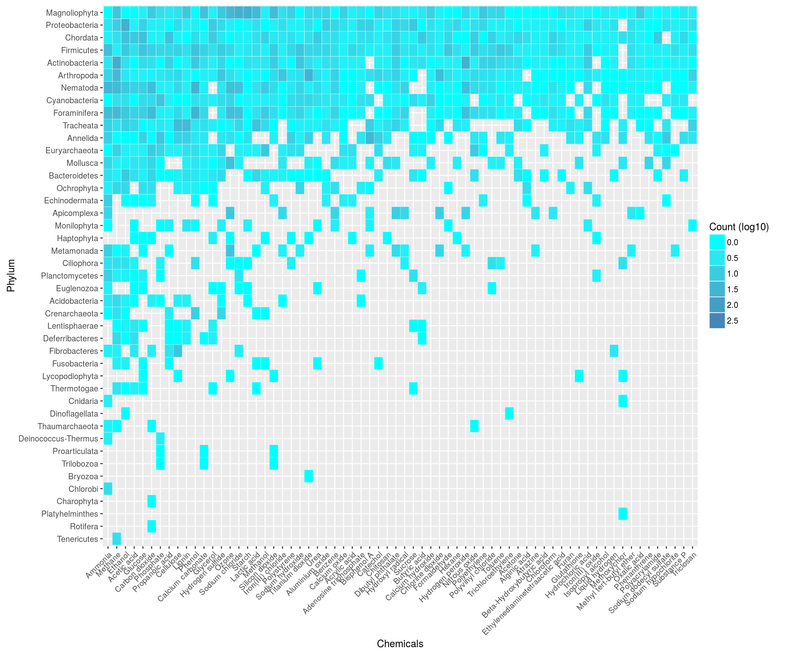](https://raw.githubusercontent.com/isdata-org/mapping-the-bioeconomy/master/CoOccurrenceMatrices/images/Top50ChemicalsPhylum.png)
 	
### Energy
#### Full Matrix
[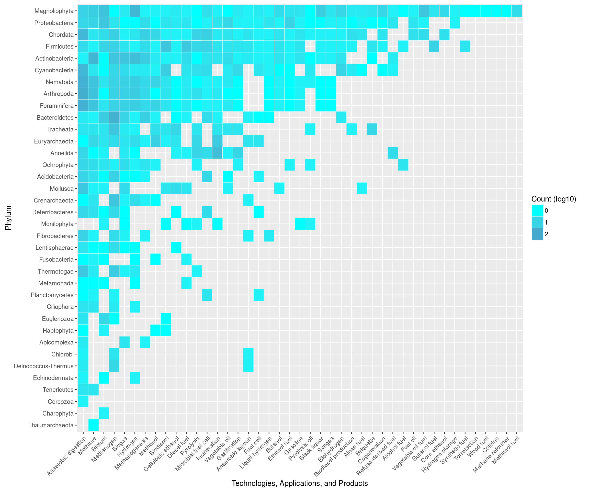](https://raw.githubusercontent.com/isdata-org/mapping-the-bioeconomy/master/CoOccurrenceMatrices/images/EnergyPhylum.png)
#### Top 15
[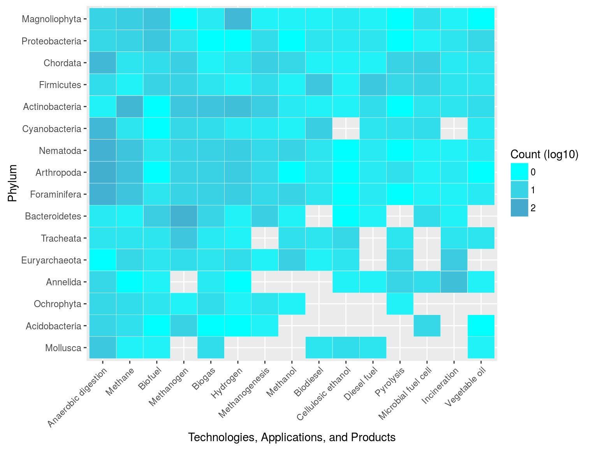](https://raw.githubusercontent.com/isdata-org/mapping-the-bioeconomy/master/CoOccurrenceMatrices/images/Top15EnergyPhylum.png)

###  Fertilizers
[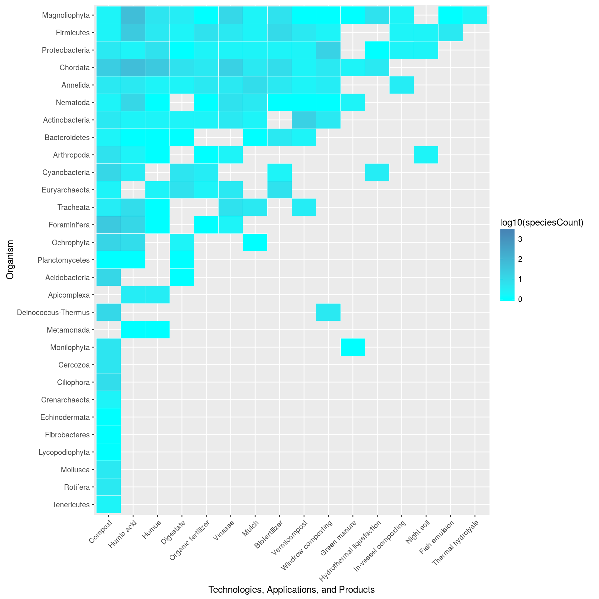](https://raw.githubusercontent.com/isdata-org/mapping-the-bioeconomy/master/CoOccurrenceMatrices/images/FertilizersTopPhylum.png)

### Products
[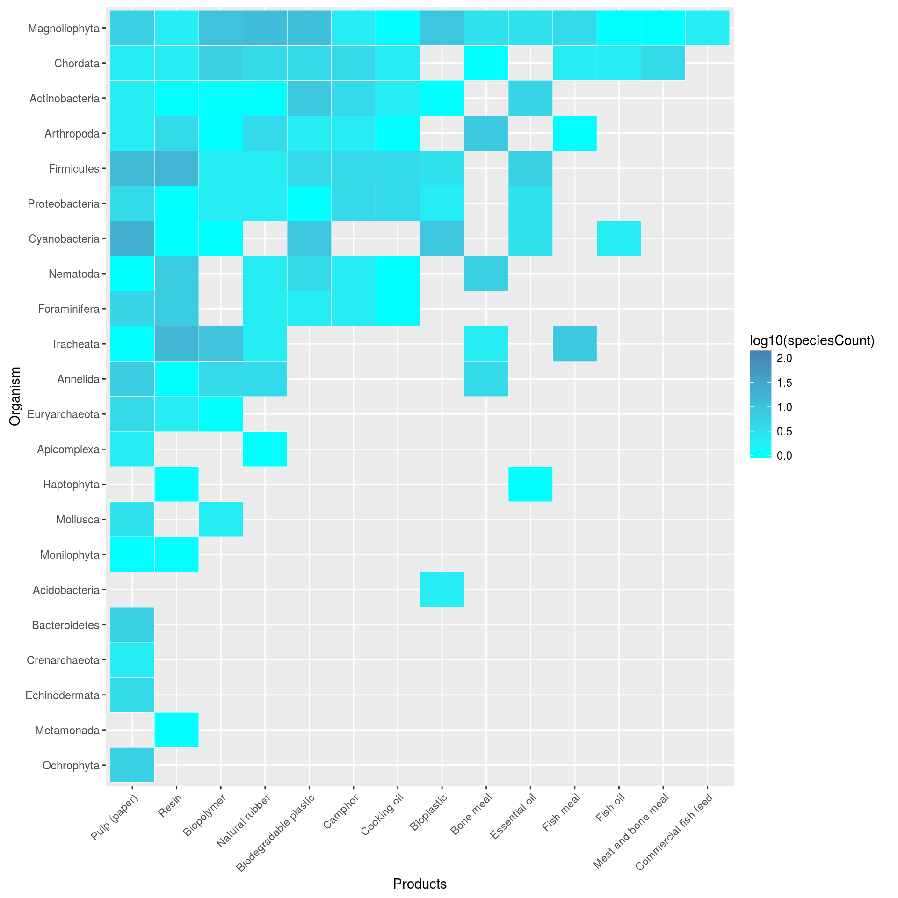](https://raw.githubusercontent.com/isdata-org/mapping-the-bioeconomy/master/CoOccurrenceMatrices/images/ProductsTopPhylum.png)

## Taxonomical Orders & Energy
### Top 15
[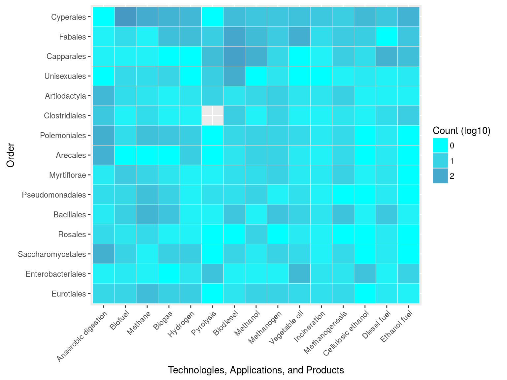](https://raw.githubusercontent.com/isdata-org/mapping-the-bioeconomy/master/CoOccurrenceMatrices/images/Top15EnergyOrder.png)
### Full Matrix
[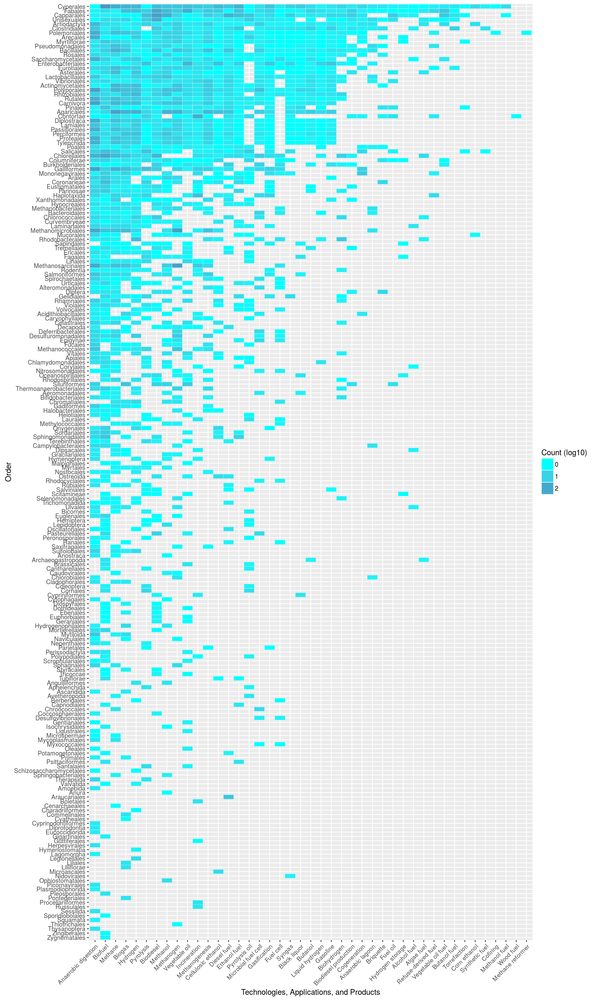](https://raw.githubusercontent.com/isdata-org/mapping-the-bioeconomy/master/CoOccurrenceMatrices/images/EnergyPerOrder.png)

## Taxonomical Classes & Energy
[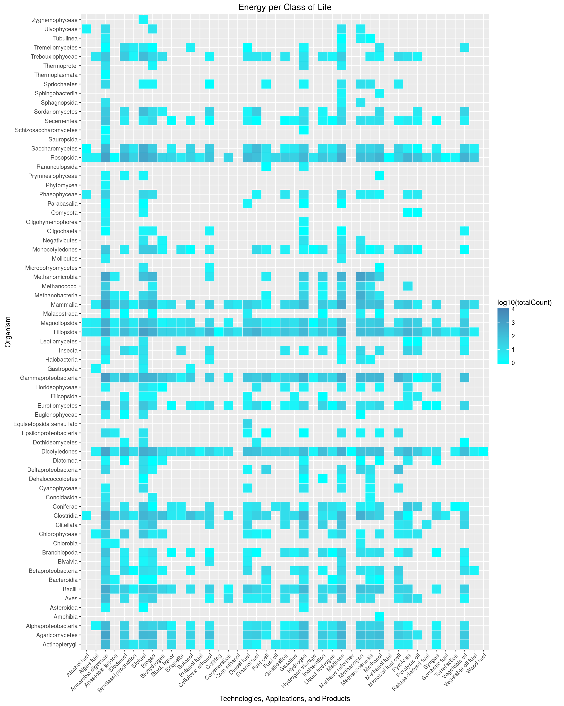](https://raw.githubusercontent.com/isdata-org/mapping-the-bioeconomy/master/CoOccurrenceMatrices/images/EnergyPerClass.png)

## Taxonomical Classes & Energy
[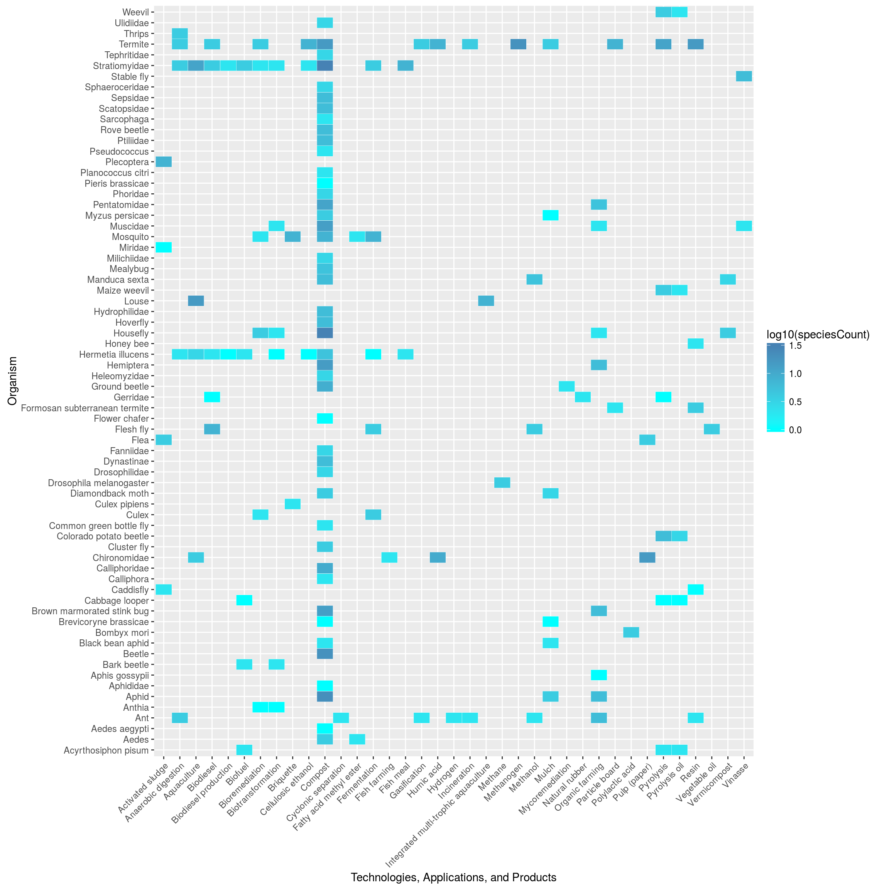](https://raw.githubusercontent.com/isdata-org/mapping-the-bioeconomy/master/CoOccurrenceMatrices/images/Insects.png)
