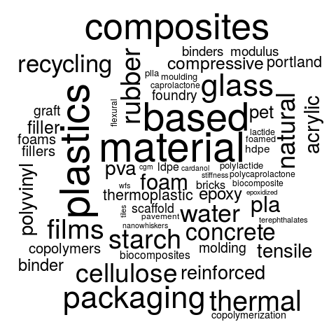
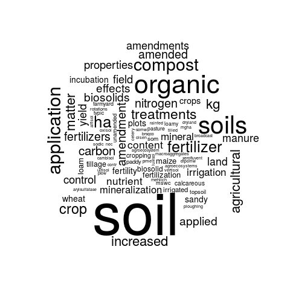
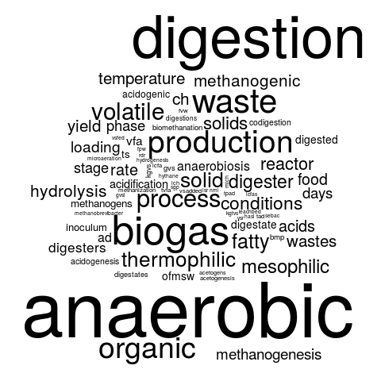
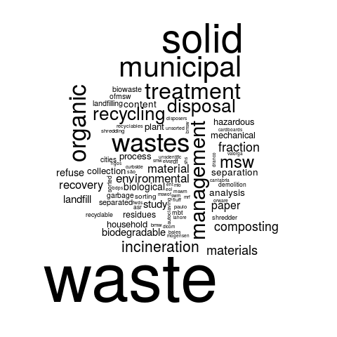
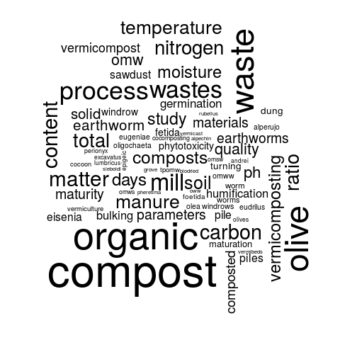

# mapping-the-bioeconomy
##Topic modelling and co-occurrence analysis of the bio-economy

This is additional online material relating to the research presented in the article:
Mapping Broad Research Activities in Complex Systems: Case of the Bio‐Based Economy and Secondary Resources (DOI)

This additional material includes:
Detailed Co-occurence maps,
[Topic Modelling](http://isdata-org.github.io/mapping-the-bioeconomy/TopicModelling/index.html) results,
...

<table cellspacing="0" cellpadding="0"><tr>
<td></td>
<td></td></tr></table><table cellspacing="0" cellpadding="0"><tr>
<td></td>
<td></td>
<td></td>
<td></td>
<td></td>
</tr></table>

## Abstract
> Several fields of research looking at complex systems are becoming more information dense in terms of the amount of articles, journals, and methods connected to their area of focus. This density makes activities such as mapping an overview of the area, surveying the work done in respect to a group of things, or identifying where certain research subjects interact a difficult task. This article employs multiple methods (literature collection, Topic Analysis, and Co-occurrence Mapping) to demonstrate how automated analyses of large bodies of literature may assist with such tasks.

> The valuation of secondary (waste) materials in the bio-based economy was chosen as a research area to present some applications and results of the combined methods. There have been few significantly broad overview studies of such materials and their valuation in the bio-based economy in part because of the multitude of materials and processes that can be used to produce energy carriers, chemicals, and materials of varying value.

> In this study, over 53,000 articles were topic modelled and mapped. The Topic Modelling presented an overview of 50 clusters of research around secondary organic resources, processes, and disciplines (such as systems analysis). The Co-occurrence Mapping helped to understand which processes are researched in relation to a broad spectrum of organic resources. When applied to waste taxonomies, the method mapped out the intersections of 63 waste materials to 112 technologies, applications, and products (TAPs). When applied to biological classifications the Co-occurrence Mapping gave even more results, 4,523 (non-zero) intersections of bio-materials and TAPs on the Order level of life.

> Such macro-survey approaches could assist in clarifying and detailing the general context of complex systems involving many processes, setting the stage for deeper studies and tool development. In addition to being of interest to new students, journal editors, and inter-disciplinary scientists, such mapping out of emerging opportunities and best practices in the field of waste and resource management could also be of use for market actors such as waste management developers, resource intensive industries, or new market entrants.

